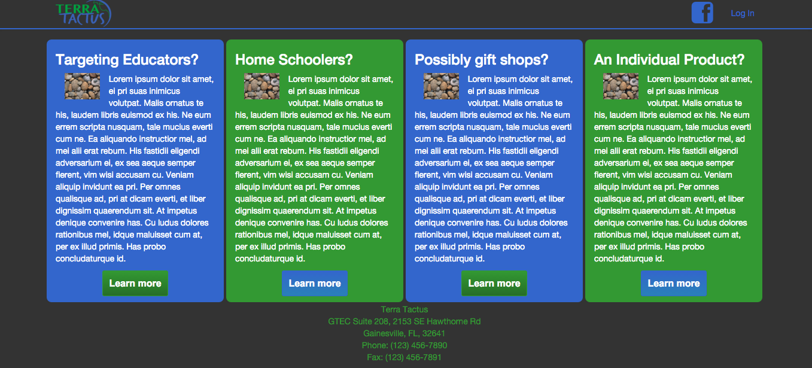
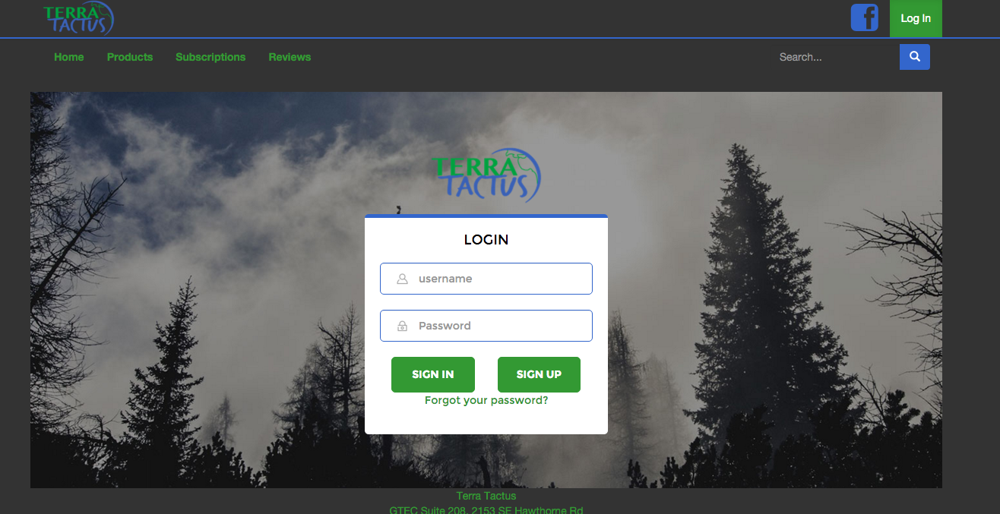
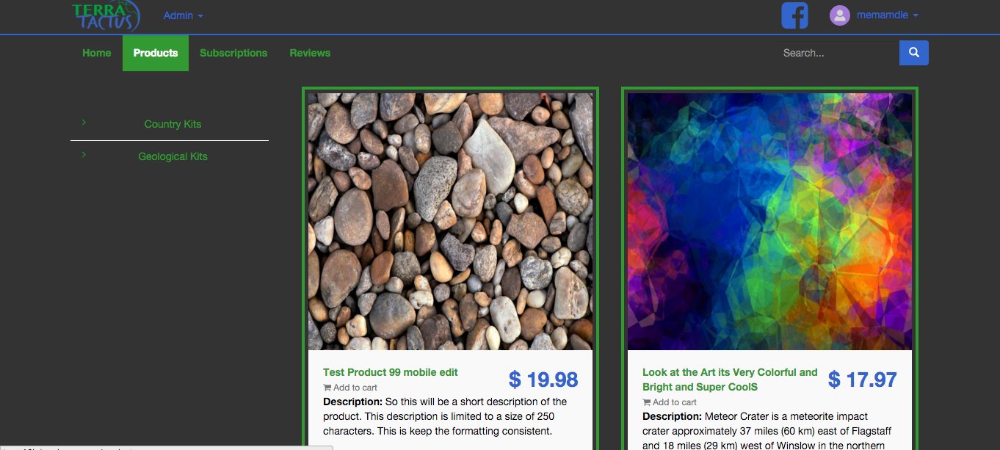
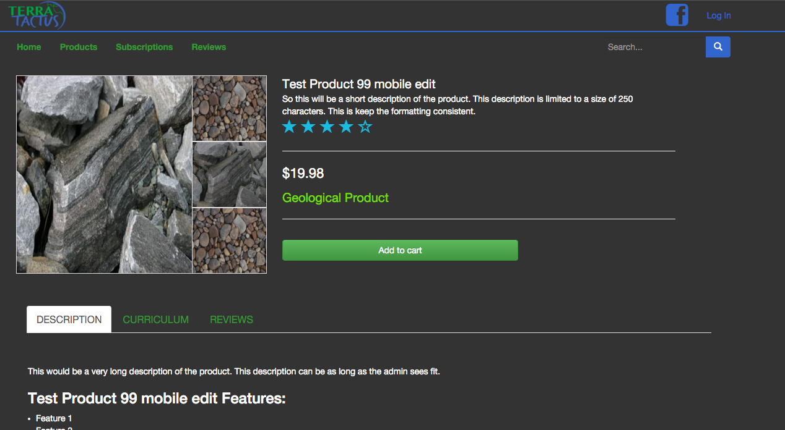
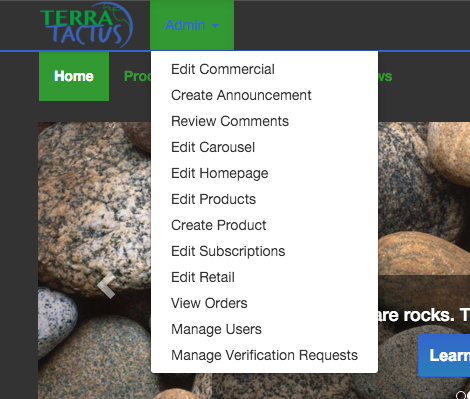

# Terra Tactus
A website that markets geological and country related artifacts. The site is also intended to teach those who purchase the kits about its contents.
This application was created for the Introduction to Software Engineering (CEN3031) class at the University of Florida, using the MEAN stack.

### Deployment Site URL: team10b.herokuapp.com

### Group Members
The group working on this project consists of the following members:
- Damian Larson [@dlarson94](https://github.com/dlarson94)
- Ivens Applyrs [@iapplyrs1](https://github.com/iapplyrs1)
- John Kaufmann [@kaufmann42](https://github.com/kaufmann42)
- Mark Turiansky [@mturiansky](https://github.com/mturiansky)
- Michelle Emamdie [@memamdie](https://github.com/memamdie)
- Raul Baharona [@barahonaraul](https://github.com/barahonaraul)

### Running the App Locally
- Install all necessary packages and libraries by following [this installation guide](https://docs.google.com/document/d/1B7aqptx0jsWHLqm7W9BT1oKHYNCKkvwtjjUtsj6C-ks/edit?pli=1)
- After cloning the remote repository to a local repository on your computer and navigating to the directory in which the app contents are located, you can run the app by using Grunt, "The Javascript Task Runner". Please see the below terminal commands that detail this process. The repository only needs to be cloned once, during the installation of the app.

```sh
$ git clone https://github.com/UFLCEN3031-10b/Terra_Tactus
$ cd Terra_Tactus
$ grunt
```

**Note!** This app was developed using Node version 0.12.7. A newer version of Node may cause this app to run differently or break altogether.

### Updating the database connection
- In the file `Terra_Tactus\config\env\development.js`.
- Change lines 6 to 11 to be your respective login credentials and mongoLab information.

## Completed Features
- Allow a user to **create an account**,**log in**, or **log out**.
    - We used the default MEAN application's functionality in the "users" module for this, located in `modules/users/`.
    - User details are saved in the `users` collection in MongoDB.


- Allow a user to **view all the products** that the company is selling.
    - Divided products into two categories, Geological and Country.
    - Products can be reviewed, looked at in further detail, or purchased.
    - Products can be added to the cart
    - Code is located in `modules/products/`.
    - Products are saved to the `products` collection in MongoDB.


- Allow the user to **checkout using PayPal**.
	- When a customer adds a product to the cart and is ready to checkout they can use the secure payment system that PayPal provides.
	- Code is located in `modules/payment/`.
	- This data is not stored in MongoDB because it is confidential customer data.


- Allow the admin user to **edit all data on the website**.
    - Admin tool bar located in `modules/core/`.
    - When signed in as an admin user you are allowed to edit the individual pages.
    - This includes editing:
        - Products located in `modules/products/`.
            - Features.
            - Curriculum.
            - Individual Product Data.
            -  Viewed by clicking the **"Who Are You?"** button or scrolling to the bottom of the homepage.
        - Subscriptions located in `modules/products/`.
            - Entire Page.
            -  Viewed by clicking the **"Who Are You?"** button or scrolling to the bottom of the homepage.
        - Retail located in `modules/products/`.
            - Entire Page.
            - Viewed by clicking the **"Who Are You?"** button or scrolling to the bottom of the homepage.
        - Commercial located in `modules/products/`.
            -  Entire Page.
            -  Viewed by clicking the **"Who Are You?"** button or scrolling to the bottom of the homepage.
        - Testimonials located in `modules/core/`.
            - Create, Modify, and Delete.
            - Viewed by clicking the **Testimonials** button in the second navigation bar.
        - Announcements located in `modules/core/`.
            -  Create, Modify, and Delete.
            -  Viewed on the right side of the homepage.
        - Homepage located in `modules/core`.
            - There is a carousel on the homepage that can also be edited.
- Allow the admin user to **send clients email from the website**.
    - When a user registers they have various user role options to choose from.
    - Depending on the option they choose, they will be required to verify that they are for example a retailer by providing Tax ID information.
    - This information will be sent using an emailer that is built into the website to send the admin emails for review.
    - Code is located in `modules/products/`.


## Incomplete Features

These bugs are explained further on the *Issues* page (https://github.com/UFLCEN3031-10b/Terra_Tactus/issues).

## Unstarted Features

- A subscriber's portal where subscribers can view all the curriculum that an admin chooses for them to see. (Desecribed in further detail by clicking on the link above)

## Testing
- Thorough client-side and server-side tests have been run to ensure that only users with the proper credentials are able to edit data on the site.
- There are Mocha, Karma, and Protractor tests.
### Screenshots
The homepage.




Signing in.



Viewing Products



Viewing Individual Products



Admin Menu



## Credits

This project incorporates a number of open source projects:

* [MEAN Stack](http://mean.io/#!/) - MongoDB, Express, Angular, and Node
* [AngularJS] - HTML enhanced for web apps!
* [node.js] - evented I/O for the backend
* [Express] - fast node.js network app framework [@tjholowaychuk]
* [MongoDB](https://www.mongodb.org/) - NoSQL Database
* [jQuery] - For basic Javascript functionalities
* [Twitter Bootstrap] - great UI boilerplate for modern web apps

And of course the Terra Tactus repository is located here on GitHub, at the following (self-referencing) URL: https://github.com/UFLCEN3031-10b/Terra_Tactus
